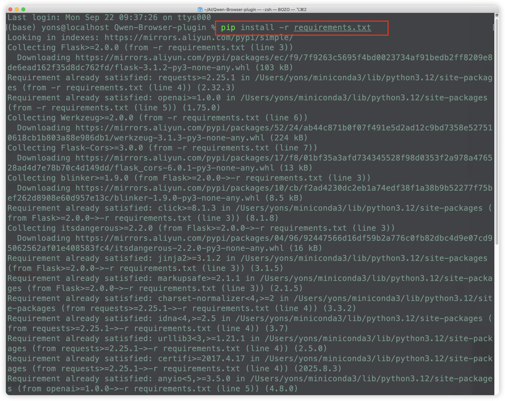
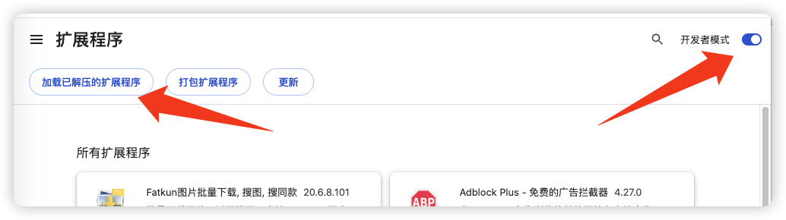
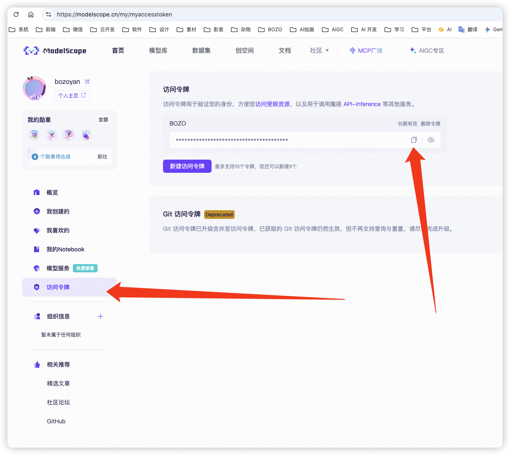
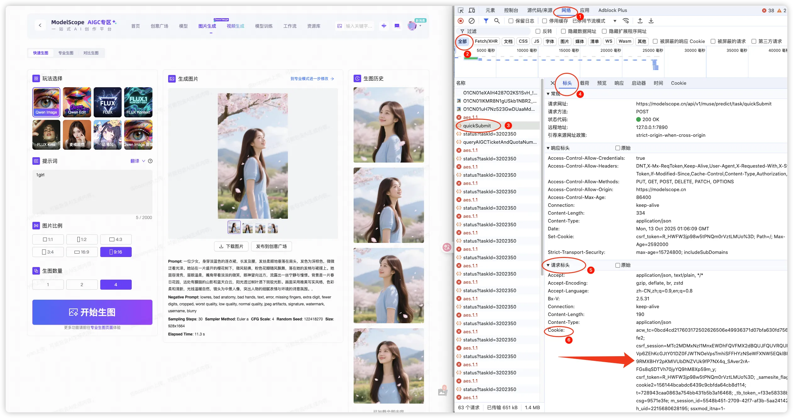
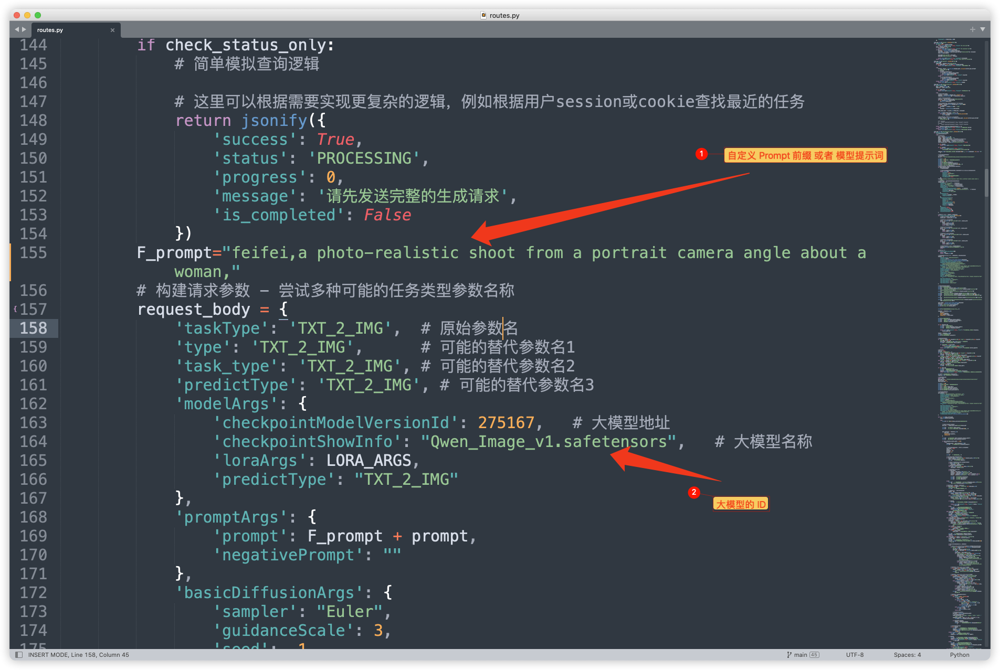
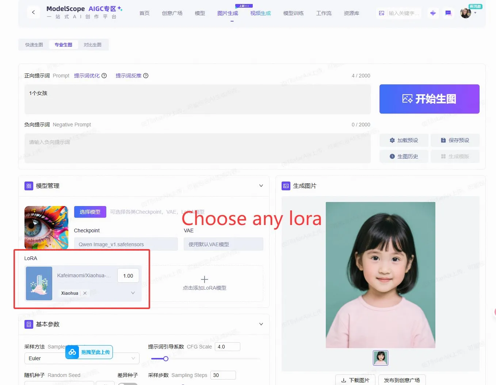
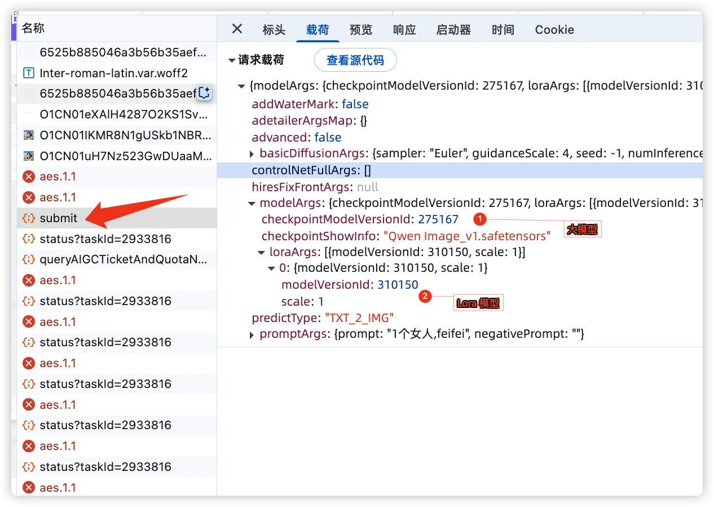
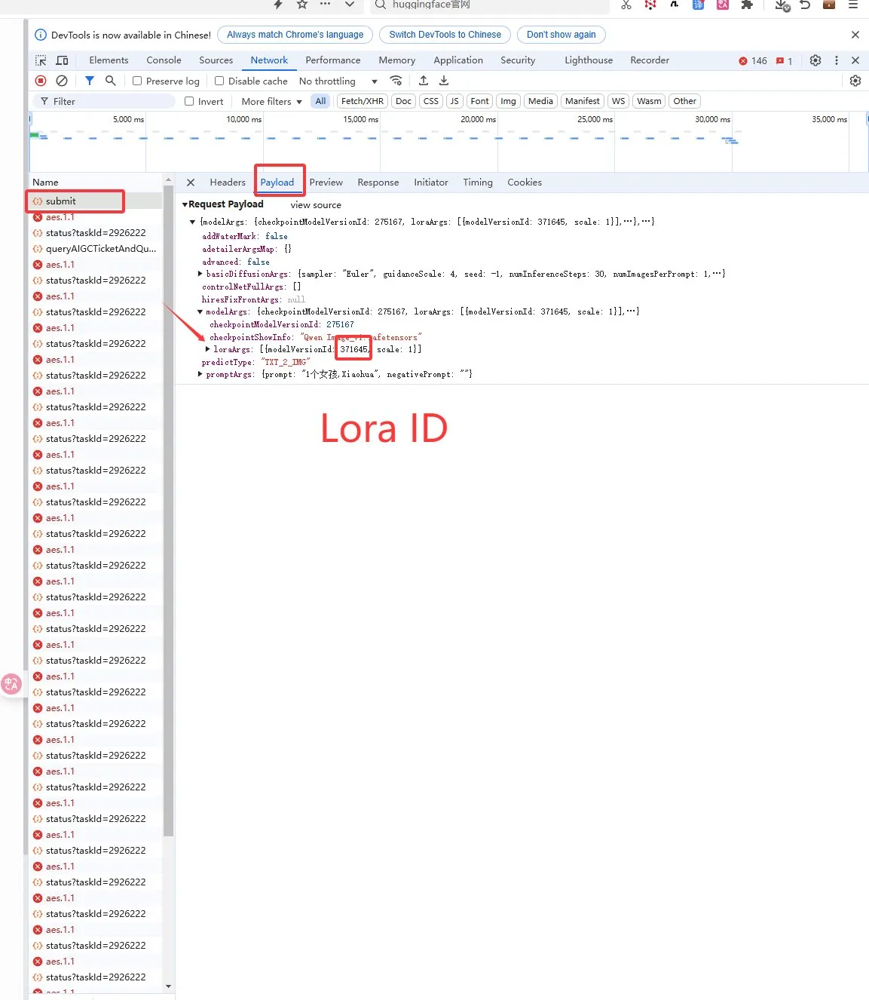
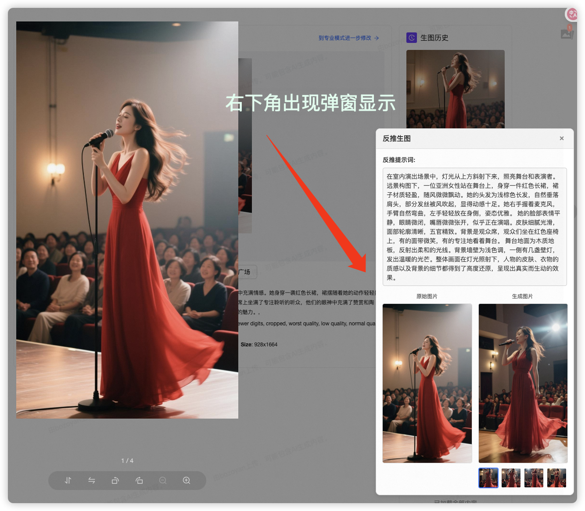
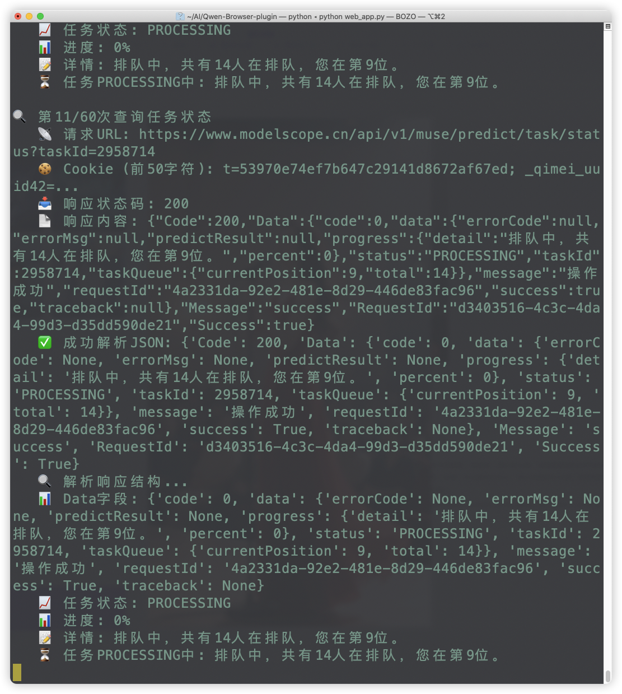

## AI 图像反推与生成工具

[](#ai-image-reverse--generation-tool)

感谢guahunyo与T8的开源，我在他们的代码基础上做了一些修改，使用了Qwen3-VL-235B-A22B-Instruct反推模型与自定义在魔搭上训练的Lora模型。


牛肉拉面不加香菜: [guahunyo](https://github.com/guahunyo)

T8star-Aix: [T8的源代码](https://github.com/T8mars/Qwen-Browser-plugin)

我并将详细的修改调整使用教程写了出来。Lora模型可以在 https://modelscope.cn/aigc/models [魔搭AIGC专区](https://modelscope.cn/aigc/models)网页中查找。

## 概述

[](#overview)

该项目是一个强大的工具，可与您的浏览器集成，提供独特的图像分析和生成工作流程。它允许用户右键单击网页上的任何图像，使用Qwen3-VL-235B-A22B-Instruct反推自动生成该图像的描述性提示，然后使用该提示创建一组新的 AI 生成图像。

整个过程直接显示在当前页面上一个干净、用户友好的模式窗口中，无需离开即可提供无缝体验。

- **chrome插件**
extension 是缩略图原始版。
extension_popup 是图片大图显示弹窗版。


## 特征

[](#features)

- **浏览器集成** ：在图像的右键单击上下文菜单中添加“反推生图”（反向图像和生成）选项。
- **反转图像提示** ：自动分析选定的图像并生成描述其内容的详细文本提示。
- **AI 图像生成** ：使用生成的提示通过 AI 模型创建四个新的独特图像。
- **交互式模式用户界面** ：
  - 显示原始图像以供参考。
  - 显示生成的文本提示。
  - 通过主图像查看器和可点击的缩略图呈现四张新图像。
  - 允许在生成的图像之间轻松切换。
- **客户端-服务器架构** ：Python Flask 后端负责处理繁重的 AI 处理任务，而轻量级浏览器扩展则提供前端界面。

## 技术堆栈

[](#technology-stack)

- **后端** ：Python、Flask
- **前端** ：JavaScript（用于浏览器扩展）、HTML、CSS
- **核心逻辑** ：
  - `image_analyzer.py` ：使用Qwen3-VL-235B-A22B-Instruct处理将图像反转为文本提示的逻辑。
  - `routes.py` ：定义图像分析和生成的 API 端点。
  - `config.py`：将config.py.template重名为config.py，然后输入key与cookie。
- **浏览器扩展** ：使用标准 WebExtension API（ `manifest.json` 、 `background.js` 、 `content.js` ）构建。

## 浏览器扩展 项目结构

[](#project-structure)

```
/
├── extension/            # Browser extension source code
│   ├── scripts/
│   │   ├── background.js # Handles context menu creation
│   │   └── content.js    # Injects the modal and handles API calls
│   └── manifest.json     # Extension configuration
├── static/               # Static assets for the web interface
├── templates/            # HTML templates for the web interface
├── image_analyzer.py     # Core logic for image-to-prompt
├── routes.py             # Flask API route definitions
├── web_app.py            # Main Flask application entry point
└── requirements.txt      # Python dependencies
```

## 设置和安装

[](#setup-and-installation)

1.  **安装 Python 依赖项** ：确保已安装 Python 3。然后，使用 pip 安装所需的软件包：

    ```bash
    pip install -r requirements.txt
    ```

2.  **运行后端服务器** ：从项目根目录启动 Flask 服务器：

    ```bash
    python web_app.py
    ```

    服务器将从 `http://127.0.0.1:8005` 启动。

3.  **加载浏览器扩展** ：

    - 打开您的浏览器（例如 Chrome、Edge）。
    - 导航到扩展管理页面（例如， `chrome://extensions` ）。
    - 启用“开发者模式”。
    - 单击“加载解压后的”并从该项目中选择 `extension` 文件夹。

## 如何使用
### 1.设定魔搭社区的密钥key与cookie
- 打开config.py文件可以设定key、cookie、LORA模型和自定义尺寸
魔搭KEY地址：https://modelscope.cn/my/myaccesstoken
[魔搭KEY地址](https://modelscope.cn/my/myaccesstoken)


- 使用魔搭社区在快速生图生成一张图片
然后F12审查代码，查找cookie，找到网络 Network---->quickSubmit---->全部---->标头Headers---->请求标头
复制Cookie里面一长串代码。



### 2.自定义prompt提示词前缀 与 自定义基础大模型
打开routes.py文件


- 自定义的Lora，可以使用魔搭社区的专业生图。



- 开始生图后，通过F12 审查元素，找到sumbit，再找请求载荷，里面就有大模型和Lora模型的地址。可以用自己的替换掉。





[](#how-to-use)

1. 导航到任何包含您想要使用的图像的网页。右键单击所需的图像。

2. 从上下文菜单中选择“反推生图”。将出现一个模态窗口。它将首先显示生成的提示，然后显示四张新生成的图像。

3. 您可以点击底部的缩略图在主显示区域中查看每个生成的图像。在终端界面上，也会显示进度消息提示。

